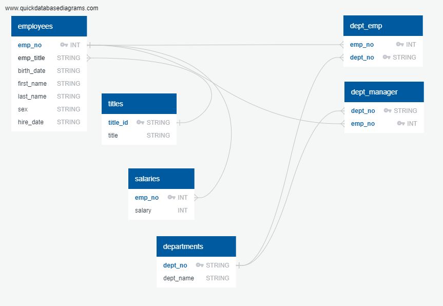
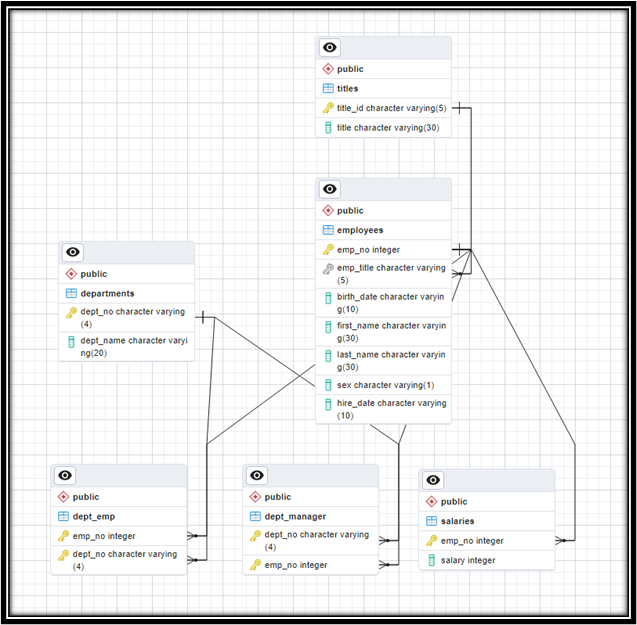

# Pewlett Hackard SQL Analysis

## Overview of Project
The purpose of this project was to analyze Company employees during the 1980s and 1990s. All that remains of the employee database from that time period were six CSV files.

Data modeling, data engineering, and data analysis were completed for the analysis.  Specifically, the following steps were completed:
<ul> •	Designed an SQL database </ul>
<ul> •	Created six tables to correspond to the six CSV files </ul>
<ul> •	Imported data from the CSV files </ul>
<ul> •	Completed queries to answer key HR questions </ul>
<hr>

## Data Modeling
QuickDBD and pgAdmin were used to created the below ERDs.




## Data Engineering
Below is the table schema developed for the database. The corresponding CSV files were then imported to each table.
```
CREATE TABLE titles(
	title_id VARCHAR(5) NOT NULL PRIMARY KEY, 
	title VARCHAR (30)
);

CREATE TABLE employees(
	emp_no INT NOT NULL PRIMARY KEY,
	emp_title VARCHAR (5),
	birth_date VARCHAR (10),
	first_name VARCHAR (30),
	last_name VARCHAR (30),
	sex VARCHAR (1),
	hire_date VARCHAR (10),
	FOREIGN KEY (emp_title) REFERENCES titles(title_id)
);

CREATE TABLE salaries(
	emp_no INT NOT NULL PRIMARY KEY,
	salary INT,
	FOREIGN KEY (emp_no) REFERENCES employees(emp_no)
);

CREATE TABLE departments(
	dept_no VARCHAR(4) NOT NULL PRIMARY KEY, 
	dept_name VARCHAR (20)
);

CREATE TABLE dept_manager(
	dept_no VARCHAR(4) NOT NULL,
	emp_no INT NOT NULL,
	PRIMARY KEY (dept_no, emp_no),
	FOREIGN KEY (emp_no) REFERENCES employees(emp_no),
	FOREIGN KEY (dept_no) REFERENCES departments(dept_no)
);

CREATE TABLE dept_emp(
	emp_no INT NOT NULL,
	dept_no VARCHAR(4) NOT NULL, 
	PRIMARY KEY (emp_no, dept_no),
	FOREIGN KEY (emp_no) REFERENCES employees(emp_no),
	FOREIGN KEY (dept_no) REFERENCES departments(dept_no)
);
```

## Data Analysis
For the data analysis portion of the project, eight queries were run to generate the following reports:  
<li><a href = "Query Results/Query 1_data-1676224140167.csv"> Complete Employee Listing (employee number, last & first name, sex, salary) </a></li>
<li><a href = "Query Results/Query 2_data-1676227624276.csv"> Employees Hired in 1986 (first & last name, hire date) </a></li>
<li><a href = "Query Results/Query 3_data-1676229890024.csv"> Department Managers (dept number, dept name, employee number, last & first name) </a></li>
<li><a href = "Query Results/Query 4_data-1676231835786.csv"> Employees’ Department Numbers (employee number, last & first name, dept name) </a></li>
<li><a href = "Query Results/Query 5_data-1676232646666.csv"> First Name 'Hercules' & Last Name 'B' Listing (first & last name, sex) </a></li>
<li><a href = "Query Results/Query 6_data-1676232994548.csv"> Sales Department Employees (employee number, last & first name) </a></li>
<li><a href = "Query Results/Query 7_data-1676233191647.csv"> Sales and Development Enployees (employee number, last & first name, dept name) </a></li>
<li><a href = "Query Results/Query 8_data-1676234311246.csv"> List of Last Names (frequency counts in descending order) </a></li>


## Query Details
<li><a href = "EmployeeSQL/Query #1.sql"> Query #1 </a></li>
<li><a href = "EmployeeSQL/Query #2.sql"> Query #2 </a></li>
<li><a href = "EmployeeSQL/Query #3.sql"> Query #3 </a></li>
<li><a href = "EmployeeSQL/Query #4.sql"> Query #4 </a></li>
<li><a href = "EmployeeSQL/Query #5.sql"> Query #5 </a></li>
<li><a href = "EmployeeSQL/Query #6.sql"> Query #6 </a></li>
<li><a href = "EmployeeSQL/Query #7.sql"> Query #7 </a></li>
<li><a href = "EmployeeSQL/Query #8.sql"> Query #8 </a></li>


## Resources
#### Data Sources: 
departments.csv, dept_emp.csvdept_manager.csv, employees.csv, salaries.csv, titles.csv
#### Software: 
SQL, PostgresSQL, pgAdmin, QuickDBD, VSCode